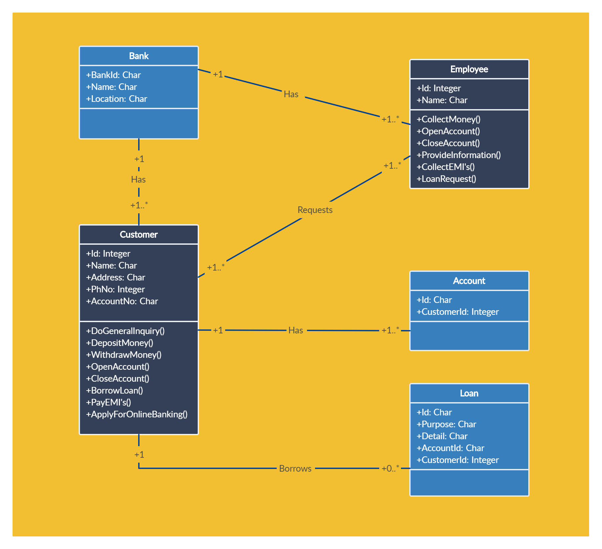

### About me 💬
>#####  `IFSP student in Systems Development`
>#####  `Software Developer`
>#####  `Abstractor`
>#####  `Requirements interpreter`
>#####  `Looking for experience in the field`
---
### Contact links 📫
######   
---
###### 
---
### Skills and experiences⚡
######             
